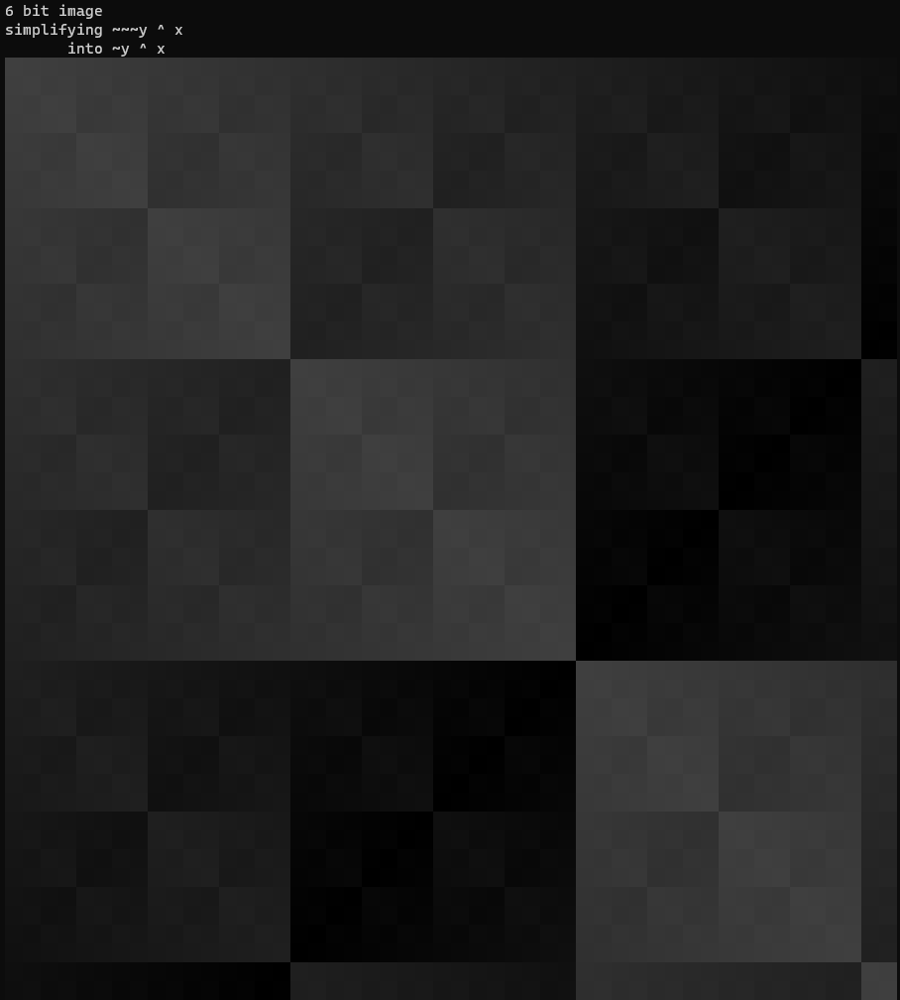
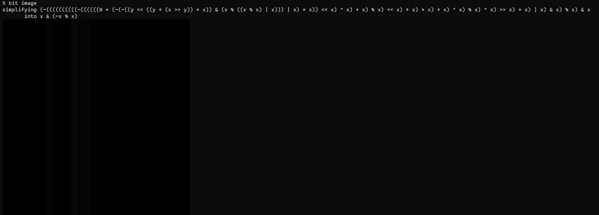
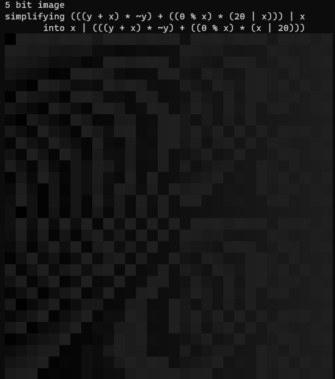

# evil-bit

Generates images by creating a random integer expression and plotting the
result. The expressions may contain constant integers, variables (`x` or `y`),
addition, multiplication and remainder, and a few different bitwise operations.
This program also uses [egg](https://egraphs-good.github.io/) to simplify th
generated expressions.

Images are output in the terminal using ANSI colors.

Inspired by [@bitartbot](https://mastodon.lol/@bitartbot@botsin.space).

## Examples

## How does it work?

First of all, the size of the image is used to determine a bit-width - the
smallest number of bits needed to represent any `x` or `y` value in the
resulting image. All the math that happens in the program are conceptually done
in a bitvector of this width (aka they're done mod 2^width).

A random expression is generated with the help of [arbitrary](https://lib.rs/crates/arbitrary).
This expression is fed into a simplifier which uses [egg](https://lib.rs/crates/egg)
to do constant folding (reducing expressions like `1 + 2` into just `3`) and
a whole bunch of "algebraic" simplifications (things like rewriting `x & ~x` to
`0`). This is usually pretty fast, but for some large expressions, it can take
a while if it contains lots of redundancies the simplifier will remove.

The simplified expression is then evaluated for every `x, y` pair in the image,
and the output value (which is a specific width bitvector) is simply truncated
to a byte and colored according to some coloring function.
